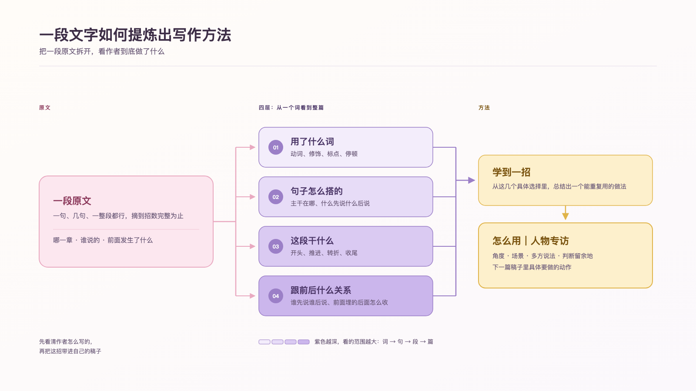

# 大师写作课 · Master Writing Skill

**上传一本书，选择一个写作目标，把全书炼成一份可以反复查阅的写作手册。**

Master Writing Skill 会完整读取一本书或一篇连贯的长文，逐章挑出最值得学习的句子和段落，再从具体文字里讲清作者怎样写人物、场景、观点、节奏与结构。

一次运行只处理一份文本和一个写作目标。下次使用时可以换书，也可以换目标。



---

## 它适合谁

你手里已经有一本想研究的书，希望解决下面一类问题：

- 这位作者的文字为什么有力量？
- 哪些句子和段落真正值得学？
- 作者怎样安排信息、人物、场景和观点？
- 这些写法怎样用进我的公众号、小红书、专访或小说？
- 我读完以后，下一篇稿子可以立刻练什么？

它的重点是**从原文中提炼写作方法**。课程与练习只占文档的一小部分，主要篇幅留给全书拆解和具体段落。

---

## 支持的写作目标

人物专访 · 杂志特稿 · 时尚评论 · 文化评论 · 小红书观点文 · 公众号深度文 · 叙事散文 · 短篇小说

也可以直接描述自己的场景，例如：

> 我想学习怎样写品牌人物故事。

> 我想让小红书笔记更有观点，同时保留叙事感。

> 我正在写一篇关于流行文化的杂志文章。

写作目标会改变选段标准。同一本书用于人物专访时，Skill 会多看人物动作、对话和材料组织；用于文化评论时，会多看判断、举证和观点推进。

---

## 你会拿到什么

### 1. 全书地图

这一部分帮助你先看懂整本书：

| 产出 | 内容 |
|---|---|
| 全书总结 | 三到五句话说清主旨，以及全书反复追问的问题 |
| 章节架构 | 一张覆盖全部章节的表格，说明每章讲了什么、怎样推动全书 |
| 核心写法 | 作者反复使用的四到六个写作动作 |
| 文风特点 | 句子长短、用词习惯、叙述距离、观点表达和节奏 |
| 飞书画板 | 用图把主旨、结构、写法和文风放在一张视野里 |

章节表一章一行。下面是虚构的格式示例，只用来展示表格怎样阅读：

| 章 | 讲了什么 | 写作看点 |
|---|---|---|
| 第一章 | 主人公准备离开故乡 | 用一个没有寄出的包裹带出人物关系 |
| 第六章 | 采访对象第一次谈到失败 | 先写手上的动作，几句以后才给出回答 |
| 终章 | 人物回到开篇出现的车站 | 重写同一地点，用变化过的细节完成收尾 |

### 2. 句子与段落拆解

这是整份文档的主体。Skill 会从不同章节挑出代表性的单句、几句话和完整段落，每张卡都回答七个问题：

| 问题 | 你会看到什么 |
|---|---|
| 前情是什么 | 这段文字出现前发生了什么 |
| 用词和标点 | 哪几个字、哪处停顿在起作用 |
| 怎么搭起来的 | 主要意思放在哪里，几句话怎样接起来 |
| 放在这儿干什么 | 它负责开头、推进、转折、举证还是收尾 |
| 可以学到哪一招 | 用一个动作给写法命名 |
| 我该怎么用 | 下一篇稿子里可以直接尝试的动作 |
| 什么时候别用 | 哪些情况下容易显得生硬或用力过猛 |

下面的原文同样是虚构示意：

> 雨停以后，修表店只开了半扇门。周师傅没有回答问题，先把桌上的三只表全都拨快了五分钟。

| 问题 | 示例拆解 |
|---|---|
| 前情是什么 | 采访刚开始，读者还不了解周师傅 |
| 用词和标点 | “半扇门”和“三只表”都能看见；“先”把回答往后压了一步 |
| 怎么搭起来的 | 第一句给环境，第二句给动作，原因暂时留着 |
| 放在这儿干什么 | 让人物带着一个具体动作出场，同时留下疑问 |
| 可以学到哪一招 | 先让人物做事，再解释他是什么样的人 |
| 我该怎么用 | 删掉人物介绍，改写成他进入采访现场后的第一个动作 |
| 什么时候别用 | 动作与人物无关时，悬念会显得刻意 |

卡片数量、讲解深度和练习难度会跟着用户水平调整。Skill 还会检查全书开头、中段、结尾、重要阶段和主要写法，缺少代表段落时继续补卡。

### 3. 从阅读到写作

文档末尾会把前面的发现整理成一组可执行动作，并附上一份短练习：

- 哪些写法最适合你的目标
- 写下一篇稿子时从哪里开始
- 一份素材包
- 一道练习题
- 一张自查清单

练习用于把刚读到的方法写一遍，篇幅约占完整交付的 10%–15%。

---

## 安装

这个仓库遵循 [Agent Skills 开放格式](https://agentskills.io/specification)：根目录包含 `SKILL.md`，细节放在 `references/`，画板参考放在 `assets/`。请安装整个文件夹，保留原有目录结构。

### Claude Code

[Claude Code 官方文档](https://code.claude.com/docs/en/skills)支持用户级 Skills 目录：

```bash
mkdir -p ~/.claude/skills
git clone https://github.com/yutongcai0628/master-writing-skill.git ~/.claude/skills/master-writing-skill
```

### Codex

[Codex 官方文档](https://developers.openai.com/codex/skills)支持以 `SKILL.md` 为入口的 Skills：

```bash
mkdir -p ~/.codex/skills
git clone https://github.com/yutongcai0628/master-writing-skill.git ~/.codex/skills/master-writing-skill
```

### Kimi Code CLI

[Kimi Code 官方文档](https://www.kimi.com/code/docs/kimi-code-cli/customization/skills.html)支持 `~/.kimi-code/skills/` 和通用的 `~/.agents/skills/`：

```bash
mkdir -p ~/.kimi-code/skills
git clone https://github.com/yutongcai0628/master-writing-skill.git ~/.kimi-code/skills/master-writing-skill
```

### WorkBuddy

1. 在 GitHub 点击 **Code → Download ZIP**，也可以直接下载 [main 分支技能包](https://github.com/yutongcai0628/master-writing-skill/archive/refs/heads/main.zip)。
2. 打开 WorkBuddy 左侧的 **专家 · 技能 · 连接器**。
3. 选择 **添加技能 → 上传技能**。
4. 选中下载的本地技能包，完成导入后启用它。

这与 [WorkBuddy 官方技能导入流程](https://www.codebuddy.cn/docs/workbuddy/From-Beginner-to-Expert-Guide/Function-Description/Skills-Market)一致。

### 其他 Agent

如果 Agent 支持 `SKILL.md` 或 Agent Skills：

1. 下载或克隆本仓库。
2. 把整个 `master-writing-skill` 文件夹放进该 Agent 的用户级或项目级 Skills 目录。
3. 确认下面这个文件直接存在：

```text
master-writing-skill/SKILL.md
```

客户端没有固定目录时，使用它的“导入 Skill”“添加本地 Skill”或同类入口选择整个文件夹。额外的 `agents/openai.yaml` 只提供 OpenAI 客户端展示信息，其他 Agent 可以直接忽略。

安装完成后建议重开一次客户端或新建会话，让 Agent 重新扫描 Skills。

---

## 使用

在支持的 Agent 里上传或提供一本书，然后直接说：

```text
请使用 master-writing-skill 拆解这本书。
文件：/path/to/book.epub
```

Skill 会先确认文件能否完整读取，再一次问你两个问题：

1. 你的写作水平：完全新手 / 写过一些但不稳定 / 有稳定产出想提升
2. 这次的写作目标：从八种类型里选一种，也可以描述具体场景

回答以后，它才会开始逐章读取和整理。

支持 PDF、EPUB、TXT、Markdown。扫描版 PDF 需要先完成 OCR。不同 Agent 的文件读取能力可能不同；遇到漏章、乱码或无法提取文本时，Skill 会说明问题并请你更换文件。

---

## 飞书文档与画板

飞书是可选的交付层，写作拆解本身可以在各类 Agent 中运行。

如果当前 Agent 能调用 [`lark-cli`](https://github.com/larksuite/cli)，并且你已经完成授权，Skill 会生成：

- 一份有清晰标题层级的飞书文档
- 全书主旨画板
- 章节结构画板
- 核心写法与文风画板
- 每组句子卡片对应的画板

画板使用淡粉、淡紫、淡黄等马卡龙色，强调层级、关系和阅读顺序。全文不设画板数量上限，实际数量由书的结构、用户水平和卡片分组决定。

开始处理前，Skill 会检查飞书 CLI 的授权状态。飞书不可用时，它会交付本地 Markdown 文件，并说明保存位置。

---

## 跨 Agent 兼容原则

- `SKILL.md` 只使用开放格式要求的 `name` 和 `description` 字段
- 所有参考文件都使用相对路径，移动整个目录后仍能找到
- 主流程不绑定 Claude、OpenAI、Kimi 或 WorkBuddy 的专属工具
- 飞书功能按当前 Agent 的工具能力启用，缺少飞书 CLI 时自动改用 Markdown
- 原书由用户提供，Skill 不会自行搜索或下载书籍
- 引用会标明章节位置，并控制在分析所需的长度内

---

## 文件结构

```text
master-writing-skill/
├── SKILL.md                      主流程、提问规则和交付标准
├── README.md                     安装与使用说明
├── LICENSE                       MIT 许可证
├── agents/
│   └── openai.yaml               OpenAI 客户端展示信息
├── references/
│   ├── source-reading.md         文件读取与漏章检查
│   ├── chapter-map.md            章节表规则
│   ├── close-reading.md          句子卡片模板
│   ├── whiteboard-spec.md        飞书画板规格
│   ├── writing-directions.md     八种写作目标的选段重点
│   ├── style-dimensions.md       文风检查清单
│   ├── book-decomposition.md     全书扫描与选段方法
│   ├── source-evidence.md        内部候选清单格式
│   ├── feishu-course-template.md 飞书文档顺序与排版
│   ├── course-completion.md      练习设计
│   └── scoring-rubric.md         作业反馈标准
└── assets/
    ├── board-reference.svg       画板参考实现
    └── board-reference.png       README 预览图
```

---

## 使用边界

- 分析只依据用户提供的文件；需要外部资料支持的判断会明确标成推测
- 文件中的材料不足时，对应栏目会保留空缺并说明原因
- 长书需要更长的处理时间；Skill 会优先保证目录、章节和代表段落覆盖完整
- Skill 提供写法、例子和练习，最终稿由用户亲自完成

---

## License

[MIT](LICENSE)
